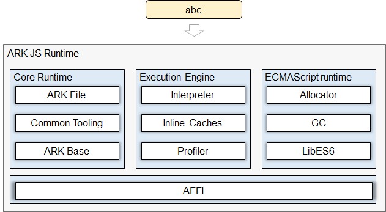

# ARK JS Runtime Module<a name="EN-US_TOPIC_0000001183610495"></a>

- [ARK JS Runtime Module<a name="EN-US_TOPIC_0000001183610495"></a>](#ark-js-runtime-module)
    - [Introduction<a name="section190813718209"></a>](#introduction)
  - [Directory Structure<a name="section161941989596"></a>](#directory-structure)
  - [Constraints<a name="section119744591305"></a>](#constraints)
  - [Build<a name="section137768191623"></a>](#build)
    - [Available APIs<a name="section175841548124517"></a>](#available-apis)
    - [Usage Guidelines<a name="section129654513264"></a>](#usage-guidelines)
  - [Repositories Involved<a name="section1371113476307"></a>](#repositories-involved)

### Introduction<a name="section190813718209"></a>

ARK JS Runtime is the runtime used by JavaScript \(JS\) applications on OpenHarmony. It consists of the JS object allocator, garbage collector \(GC\), a standard library compliant with ECMAScript specifications, ARK bytecode interpreter, inline caches that store hidden classes, and the ARK Foreign Function Interface \(AFFI\).

For more infomation, see: [ARK Runtime Subsystem](https://gitee.com/openharmony/docs/blob/master/en/readme/ARK-Runtime-Subsystem.md).

**ARK JS runtime architecture**



## Directory Structure<a name="section161941989596"></a>

```
/ark/js_runtime
├─ ecmascript             # JS object definition
│   ├─ base               # Base helper class
│   ├─ builtins           # ECMAScript library
│   ├─ class_linker       # Bytecode pre-processing module
│   ├─ compiler           # JS compiler
│   ├─ hprof              # Memory analysis utility class
│   ├─ ic                 # Inline cache module
│   ├─ interpreter        # JS interpreter
│   ├─ jobs               # Queue of jobs
│   ├─ js_vm              # ARK command line tool
│   ├─ mem                # Memory management module
│   ├─ napi               # External native interface
│   ├─ regexp             # Regular expression engine module
│   ├─ snapshot/mem       # Snapshot module
│   ├─ tests              # Unit test cases
│   ├─ thread             # Thread pool
│   ├─ tooling            # JS debugger
│   └─ vmstat             # Runtime status utility classes
└─ test                   # Module test cases
```

## Constraints<a name="section119744591305"></a>

* Only the bytecode file generated by the ARK JS frontend can be run.
* Only support ES2015 standard and strict mode ("use strict").
* Don't support dynamically create functions via string (e.g., new Function("console.log(1))).

## Build<a name="section137768191623"></a>

```
./build.sh --product-name Hi3516DV300 --build-target ark_js_runtime
```

### Available APIs<a name="section175841548124517"></a>

For details, see  [NAPI](https://gitee.com/openharmony/ace_napi/blob/master/README.md).

### Usage Guidelines<a name="section129654513264"></a>

For details about how to generate JS bytecodes, see  [Using the Toolchain](docs/using-the-toolchain.md).

To run bytecodes: 
```
$ cd out/release
$ export LD_LIBRARY_PATH=clang_x64/ark/ark_js_runtime:clang_x64/ark/ark:clang_x64/global/i18n:../../prebuilts/clang/ohos/linux-x86_64/llvm/lib/
$ ./clang_x64/ark/ark_js_runtime/ark_js_vm helloworld.abc
```

For more infomation, please see: [ARK-Runtime-Usage-Guide](https://gitee.com/openharmony/ark_js_runtime/blob/master/docs/ARK-Runtime-Usage-Guide.md).

## Repositories Involved<a name="section1371113476307"></a>

[ark\_runtime\_core](https://gitee.com/openharmony/ark_runtime_core)

**[ark\_js\_runtime](https://gitee.com/openharmony/ark_js_runtime)**

[ark\_ts2abc](https://gitee.com/openharmony/ark_ts2abc)
